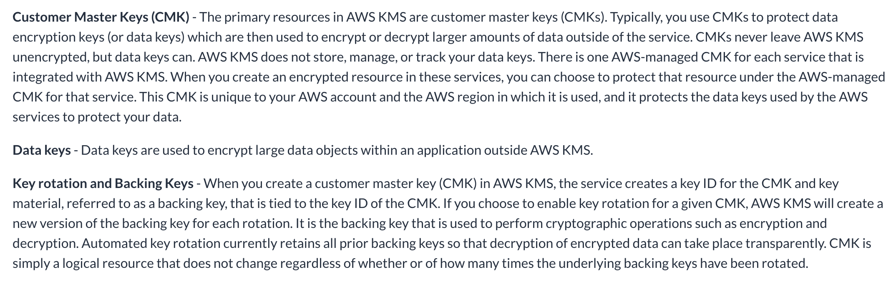

In the associated lab we will step through using AWS KMS to encrypt S3 and EBS data. Our objective is to become more familiar with Amazon's Key Management Service and how it can be used to generate encryption keys used to encrypt/decrypt your data.

- 🔗 | [Holiday Inn Club (Use code: OR IB for discount!)](https://holidayinnclub.com/)
- 🔗 | [Support Software Builds](https://www.buymeacoffee.com/kadad1312d)
- 🔗 | [Schedule Tutoring With Me](https://www.calendly.com/kadad1312)
- 🔗 | [YouTube Channel](https://www.youtube.com/@RealKhaledAdad)

### Video Explanation:

Amazon Key Management Service (KMS) is a fully managed service that makes it easy for you to create and control the encryption keys used to encrypt your data, and use those keys to encrypt data in S3 and EBS.

S3 is Amazon's Simple Storage Service, which is an object storage service that offers industry-leading scalability, data availability, security, and performance. EBS is Amazon's Elastic Block Store, which is a block storage service that enables you to create storage volumes and attach them to Amazon Elastic Compute Cloud (EC2) instances.

When you use KMS to encrypt your S3 and EBS data, you can be sure that your data is secure both at rest and in transit. KMS uses Advanced Encryption Standard (AES) with a 256-bit key to encrypt your data, which is a widely accepted and secure encryption standard.

To use KMS to encrypt your S3 and EBS data, you first need to create a key in KMS. Once you have created a key, you can use it to encrypt your S3 and EBS data by specifying the key when you create a new S3 bucket or EBS volume.

When you upload data to S3, you can specify that the data should be encrypted with the KMS key you created. When you create a new EBS volume, you can specify that the volume should be encrypted with the KMS key you created.

In addition to encryption, KMS also provides you with fine-grained access control over the keys you create. You can grant or revoke permissions to users and roles, and you can also audit the use of your keys.

In summary, using Amazon KMS for encrypting S3 and EBS data is a simple, secure and cost-effective way to protect your data at rest and in transit. It gives you the control to manage your encryption keys, and the flexibility to encrypt data in S3 and EBS in a way that suits your use case.

### Tool Belt
- [Tesla](https://ts.la/khaled835973)
- [Online School/EdX](https://www.edx.org/?utm_source=google&utm_campaign=18736834479&utm_medium=cpc&utm_term=edx&hsa_acc=7245054034&hsa_cam=18736834479&hsa_grp=140243978342&hsa_ad=631521652739&hsa_src=g&hsa_tgt=kwd-89882436&hsa_kw=edx&hsa_mt=e&hsa_net=adwords&hsa_ver=3&gclid=Cj0KCQiA0oagBhDHARIsAI-BbgfFSx9sQrdOhE0zshO9rXNE6ZsM_6g0CsF0uBeLd3GwriWBoJtxVXwaAqA2EALw_wcB)
- [Liquid I.V. Hydration Multiplier 30 Stick, 16.93 Ounce](https://amzn.to/3ZFDjDq)
- [C4 Energy Drink 12oz (Pack of 12) - Frozen Bombsicle - Sugar Free Pre Workout Performance Drink with No Artificial Colors or Dyes](https://amzn.to/3ZEVtFy)
- [Cellucor C4 Energy Drink, STARBURST Strawberry, Carbonated Sugar Free Pre Workout Performance Drink with no Artificial Colors or Dyes, Pack of 12](https://amzn.to/3y8KJ6m)
- [GHOST ENERGY Sugar-Free Energy Drink - 12-Pack, SOUR PATCH KIDS Redberry, 16oz - Energy & Focus & No Artificial Colors - 200mg of Natural Caffeine, L-Carnitine & Taurine - Soy & Gluten-Free, Vegan](https://amzn.to/3Jeaed7)
- [GHOST Legend Pre-Workout Energy Powder, Sour Patch Kids Redberry - 25 Servings - Caffeine, L-Citrulline, & Beta Alanine Blend for Energy Focus & Pumps - Free of Soy, Sugar & Gluten, Vegan](https://amzn.to/3SOshts)
- [GHOST WHEY Protein Powder, Chips Ahoy! - 2lb, 25g of Protein - Whey Protein Blend - ­Post Workout Fitness & Nutrition Shakes, Smoothies, Baking & Cooking - Cookie Pieces Inside](https://amzn.to/3y8rGtd)
- [GHOST Size Muscle Builder Dietary Supplement - Mango, 30 Servings - Muscle Growth and Strength Building Supplements for Men & Women - Creatine, Betaine & Beta-Alanine - Free of Sugar & Gluten, Vegan](https://amzn.to/3YkH8g8)
- [GHOST Greens Superfood Powder, Guava Berry - 30 Servings - 19 Super Greens & Reds, Fruits, Vegetables, Spirulina, & Chlorella, Prebiotics, 10 Billion CFU Probiotic & Digestive Enzymes - Gluten-Free](https://amzn.to/3J8I0PN)
- [Coding Projects](https://www.buymeacoffee.com/kadad1312d)
- [Lenovo Yoga 7i 16 inch 2.5K Touchscreen 2-in-1](https://amzn.to/41CfSfY)
- [Sour Strips](https://amzn.to/3EDWUM7)

### Make 💰 By Learning Programming:

- [Impractical Python Projects](https://amzn.to/3JpCpWH)
- [Designing Data-Intensive Applications](https://amzn.to/3Hgh5Sj)
- [Python for Data Analysis](https://amzn.to/3D0C8pl)
- [Python for Data Science Handbook](https://amzn.to/3XnZ1ez)
- [Hands-On Machine Learning w/Scikit-Learn & Tensorflow](https://amzn.to/3QTWoyt)

 