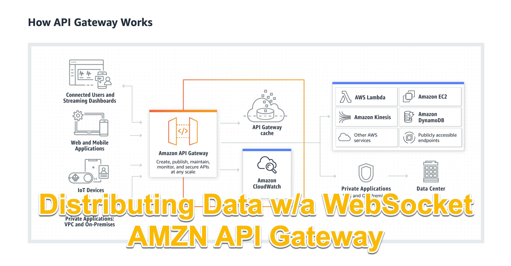

In today's digital age, APIs have become a crucial component in building modern software applications that connect disparate systems and allow data to flow seamlessly between them. Amazon API Gateway is a powerful tool that provides a simple, scalable, and secure way to build, deploy, and manage APIs. It enables developers to build and run APIs that can interact with other AWS services or external HTTP endpoints. In this two-minute read, we will explore how to use Amazon API Gateway and the benefits it offers to developers looking to build and manage APIs at scale.
### Video Explanation:

Amazon API Gateway is a fully managed service that makes it easy to create, deploy, and manage APIs at any scale. It enables developers to build and run APIs that access AWS services or any other HTTP endpoints.

Here are the steps to use Amazon API Gateway:

Create an API: Start by creating a new API in the Amazon API Gateway console. You can choose from REST, WebSocket, or HTTP APIs, depending on your use case. REST APIs are best suited for building scalable and flexible APIs that can interact with other AWS services, while WebSocket APIs are ideal for building real-time applications like chatbots and gaming apps.

Define API resources: Once you've created your API, you can define the resources that your API will expose. Resources are the endpoints that the client can interact with. You can define the HTTP methods that are allowed for each resource, such as GET, POST, PUT, DELETE, and more.

Set up integrations: Next, you'll need to set up integrations that connect your API to the backend services that it will interact with. API Gateway provides several integration options, including Lambda functions, HTTP endpoints, and AWS services like DynamoDB, S3, and more.

Deploy your API: After you've defined your resources and set up integrations, you can deploy your API to a stage. A stage is a version of your API that's ready for use by clients. You can create multiple stages, such as development, staging, and production.

Secure your API: API Gateway provides several security options to ensure that your API is secure. You can use AWS Identity and Access Management (IAM) to control access to your API, and you can use HTTPS to encrypt traffic between your API and your clients.

Benefits of Amazon API Gateway:

Scalability: Amazon API Gateway is a fully managed service that can handle any amount of traffic, so you don't have to worry about scaling your API to handle high traffic volumes.

Security: API Gateway provides several security features, including access control and encryption, to ensure that your API is secure.

Integration: API Gateway makes it easy to integrate your API with other AWS services and third-party services, so you can build powerful applications quickly.

Monitoring: API Gateway provides real-time monitoring and logging of your API, so you can quickly identify and troubleshoot any issues.

Cost-effective: API Gateway is a pay-as-you-go service, which means you only pay for the resources you use. This makes it a cost-effective option for building and running APIs.

### Make 💰 By Learning Programming:
- [Tesla](https://ts.la/khaled835973)
- [Liquid I.V. Hydration Multiplier 30 Stick, 16.93 Ounce](https://amzn.to/3ZFDjDq)
- [Xeela Pre workout]()
- [Sour Strips](https://amzn.to/3EDWUM7)

- [Impractical Python Projects](https://amzn.to/3JpCpWH)
- [Designing Data-Intensive Applications](https://amzn.to/3Hgh5Sj)
- [Python for Data Analysis](https://amzn.to/3D0C8pl)
- [Python for Data Science Handbook](https://amzn.to/3XnZ1ez)
- [Hands-On Machine Learning w/Scikit-Learn & Tensorflow](https://amzn.to/3QTWoyt)

 