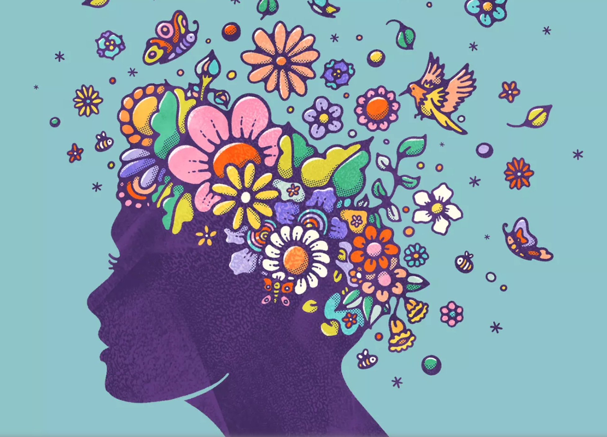

Mental health is a crucial aspect of overall well-being, yet it is often overlooked and stigmatized in our society. Mental health refers to the state of one's emotional, psychological, and social well-being, and it is just as important as physical health.
### Video Explanation:

Many people experience mental health challenges at some point in their lives, such as anxiety, depression, and stress. These challenges can arise from a variety of factors, including genetic predispositions, life experiences, and environmental factors. It is important to recognize that mental health challenges are not a personal failing and seeking help is a sign of strength, not weakness.

Taking care of your mental health is essential, and there are many ways to do so. Some helpful practices include:

Practicing self-care: Engage in activities that promote your well-being, such as exercise, getting enough sleep, and spending time with loved ones.

Seeking support: Talk to a trusted friend or family member, join a support group, or seek professional help from a mental health provider.

Managing stress: Practice stress-management techniques such as mindfulness, meditation, or deep breathing exercises.

Maintaining a healthy lifestyle: Eating a balanced diet, avoiding drugs and alcohol, and staying physically active can all have positive impacts on mental health.

It is also important to break down the stigma surrounding mental health challenges. Everyone deserves to be treated with compassion and respect, regardless of their mental health status. Educating ourselves and others about mental health can help reduce the stigma and increase access to treatment.

In conclusion, mental health is an essential component of overall well-being. Practicing self-care, seeking support, managing stress, and maintaining a healthy lifestyle can all have positive impacts on mental health. It is also important to work towards breaking down the stigma surrounding mental health and promoting understanding and acceptance. Remember, it is never too late to seek help and prioritize your mental health.

### Make 💰 By Learning Programming:
- [Tesla](https://ts.la/khaled835973)
- [Liquid I.V. Hydration Multiplier 30 Stick, 16.93 Ounce](https://amzn.to/3ZFDjDq)
- [Xeela Pre workout](https://amzn.to/3NXWwMD)
- [Sour Strips](https://amzn.to/3EDWUM7)
- [Impractical Python Projects](https://amzn.to/3JpCpWH)
- [Designing Data-Intensive Applications](https://amzn.to/3Hgh5Sj)
- [Python for Data Analysis](https://amzn.to/3D0C8pl)
- [Python for Data Science Handbook](https://amzn.to/3XnZ1ez)
- [Hands-On Machine Learning w/Scikit-Learn & Tensorflow](https://amzn.to/3QTWoyt)

 