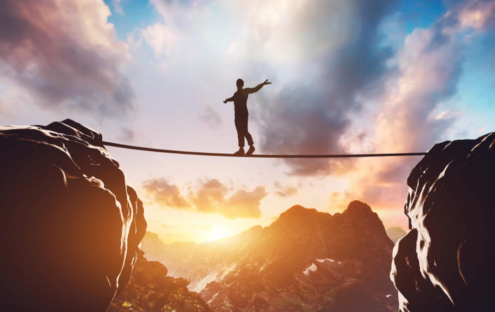

While developing self-confidence is important, it's also important to recognize that everyone experiences moments of doubt and insecurity. It's okay to feel vulnerable and ask for help when needed. Building self-confidence is a gradual process that requires patience, self-reflection, and a willingness to learn and grow. It's important to focus on personal progress rather than comparing oneself to others, as everyone has their own unique strengths and weaknesses. By cultivating a sense of self-awareness and self-acceptance, individuals can develop a strong sense of self-confidence that will help them navigate life's challenges with greater ease and resilience.
### Video Explanation:

Self-confidence is an essential ingredient for success in any area of life. It is the belief in one's abilities, qualities, and judgment, which helps to overcome challenges and reach goals. Without self-confidence, individuals may doubt their abilities, feel insecure, and avoid taking risks. This can lead to missed opportunities and a lack of personal fulfillment.

Developing self-confidence is an ongoing process that involves several factors, including self-awareness, self-acceptance, and self-improvement. Here are some reasons why building self-confidence is so important:

1. Increases resilience: People with high self-confidence are better equipped to handle setbacks and failures. They are more likely to bounce back from challenges and view them as learning opportunities, rather than as insurmountable obstacles.

2. Improves communication: Confident individuals are more effective communicators. They are better able to express themselves clearly and assertively, without fear of judgment or rejection. This can lead to better relationships and greater influence.

3. Enhances performance: Self-confidence can improve performance in a variety of areas, including academics, sports, and career. It can also increase creativity and innovation, as individuals are more willing to take risks and think outside the box.

4. Boosts happiness: Developing self-confidence can lead to greater self-esteem and a more positive outlook on life. This can result in increased happiness and fulfillment, as individuals feel more in control of their lives and able to pursue their passions and goals.

There are many strategies that can help to build self-confidence, including setting achievable goals, practicing self-care, and seeking out supportive relationships. It is important to remember that self-confidence is not an all-or-nothing proposition, and that everyone has strengths and weaknesses. By focusing on personal growth and development, individuals can gradually build their self-confidence and achieve greater success and happiness in all areas of life.

### Make 💰 By Learning Programming:
- [Tesla](https://ts.la/khaled835973)
- [Liquid I.V. Hydration Multiplier 30 Stick, 16.93 Ounce](https://amzn.to/3ZFDjDq)
- [Xeela Pre workout]()
- [Sour Strips](https://amzn.to/3EDWUM7)

- [Impractical Python Projects](https://amzn.to/3JpCpWH)
- [Designing Data-Intensive Applications](https://amzn.to/3Hgh5Sj)
- [Python for Data Analysis](https://amzn.to/3D0C8pl)
- [Python for Data Science Handbook](https://amzn.to/3XnZ1ez)
- [Hands-On Machine Learning w/Scikit-Learn & Tensorflow](https://amzn.to/3QTWoyt)

 