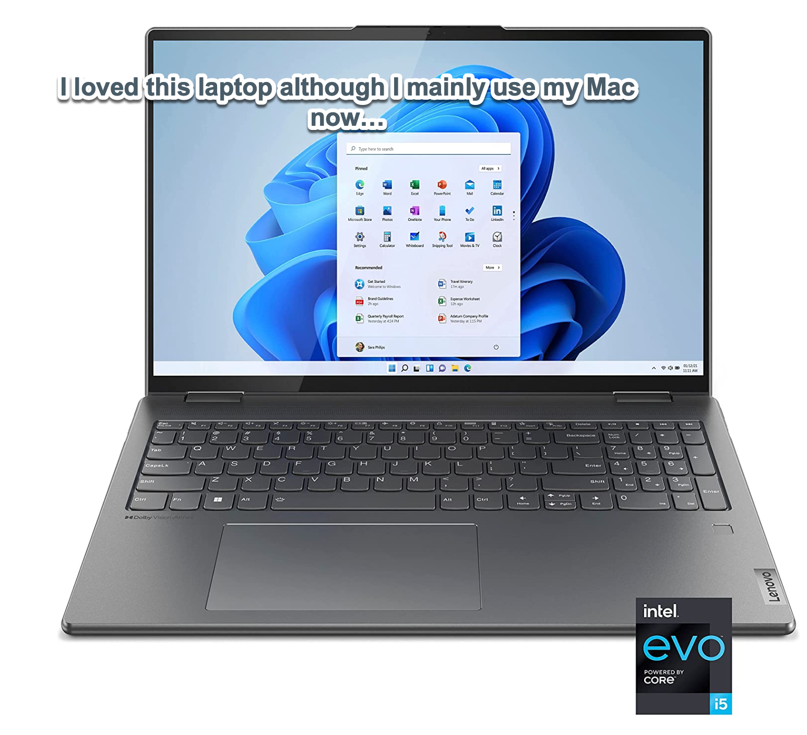

In today's fast-paced and ever-evolving world, having a reliable and versatile laptop is more important than ever. Enter the Lenovo Yoga 7i 16 inch 2.5K Touchscreen 2-in-1 Convertible Laptop - a powerful and innovative device that can adapt to your every need. With its stunning display, powerful performance, and wide range of features, this laptop is a perfect option for anyone looking for a versatile and capable machine that can be used in a variety of different modes. Whether you're a student, a professional, or just someone who wants to stay connected and productive, the Lenovo Yoga 7i is sure to exceed your expectations. In this article, we'll take a closer look at what makes the Lenovo Yoga 7i such a great laptop and explore its many features and capabilities.

### Video Explanation:

The Lenovo Yoga 7i 16 inch 2.5K Touchscreen 2-in-1 Convertible Laptop is a versatile and powerful laptop that can be used in a variety of different modes, including laptop, tablet, tent, and stand mode. With a 16 inch display and a resolution of 2560 x 1600, this laptop provides an immersive viewing experience with stunning visuals and vibrant colors.

Under the hood, the Lenovo Yoga 7i is powered by the latest 11th Gen Intel Core i7 processor and features 12GB of RAM, making it a great option for both productivity and entertainment. The laptop also comes with a 512GB SSD, which provides fast and reliable storage for all your files and applications.

One of the standout features of the Lenovo Yoga 7i is its touchscreen display, which supports 10-point multi-touch and is highly responsive. This makes it easy to navigate through apps, scroll through web pages, and zoom in on images and videos.

The laptop also comes with an active pen, which is perfect for taking notes, sketching, and drawing. The pen is highly accurate and provides a natural writing experience, making it a great tool for artists and designers.

In terms of connectivity, the Lenovo Yoga 7i comes with a wide range of ports, including two Thunderbolt 4 ports, a USB-A 3.2 Gen 1 port, a headphone/microphone combo jack, and an HDMI 2.0 port. It also features Wi-Fi 6 and Bluetooth 5.0, making it easy to connect to the internet and other devices.

Overall, the Lenovo Yoga 7i 16 inch 2.5K Touchscreen 2-in-1 Convertible Laptop is a great option for anyone looking for a powerful and versatile laptop that can be used in a variety of different ways. With its stunning display, powerful performance, and wide range of features, it's sure to meet the needs of even the most demanding users.

### My Favorite Windows Computer

- [Lenovo Yoga 7i 16 inch 2.5K Touchscreen 2-in-1](https://amzn.to/41CfSfY)

### Buy Sour Strips Now!

- [Sour Strips](https://amzn.to/3EDWUM7)

### Make 💰 By Learning Programming:

- [Impractical Python Projects](https://amzn.to/3JpCpWH)
- [Designing Data-Intensive Applications](https://amzn.to/3Hgh5Sj)
- [Python for Data Analysis](https://amzn.to/3D0C8pl)
- [Python for Data Science Handbook](https://amzn.to/3XnZ1ez)
- [Hands-On Machine Learning w/Scikit-Learn & Tensorflow](https://amzn.to/3QTWoyt)

 