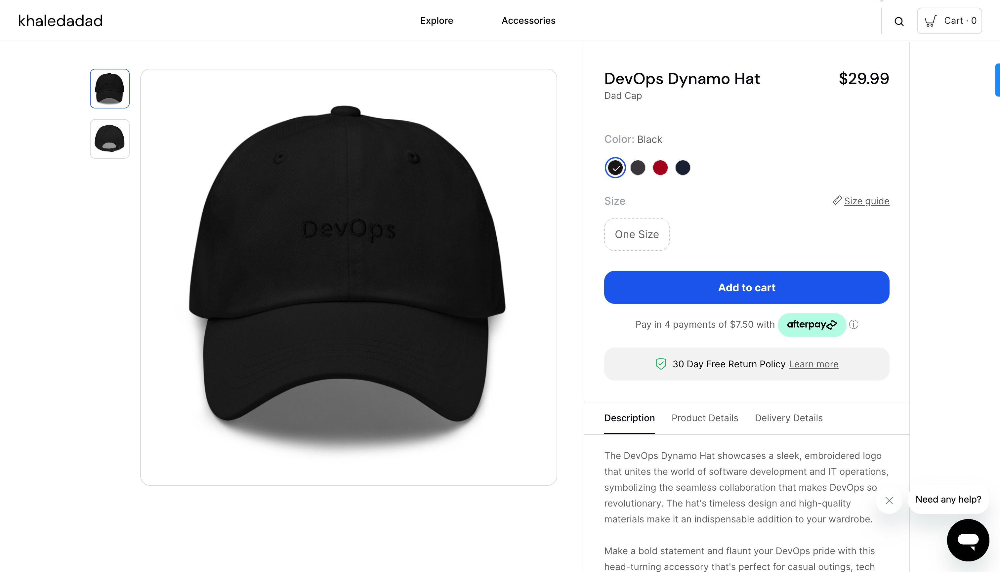

Introducing the DevOps Dynamo Hat - A Perfect Blend of Style, Comfort, and Tech-savvy Swagger!

Looking for a hat that truly represents your passion for DevOps while keeping you stylish and comfortable? Our DevOps Dynamo Hat is the ultimate accessory that speaks volumes about your commitment to innovation and efficiency!

- 🔗 | [Holiday Inn Club](https://holidayinnclub.com/)
- 🔗 | [Support Software Builds](https://www.buymeacoffee.com/kadad1312d)
- 🔗 | [Schedule Tutoring With Me](https://www.calendly.com/kadad1312)
- 🔗 | [YouTube Channel](https://www.youtube.com/@RealKhaledAdad)
 
 
<!--  -->

Crafted with a premium blend of soft, breathable materials, this one-size-fits-all masterpiece snugly embraces your head, giving you the perfect fit every time. It features an adjustable strap, ensuring the ultimate in comfort and adaptability, no matter your head size or hairstyle.

The DevOps Dynamo Hat showcases a sleek, embroidered logo that unites the world of software development and IT operations, symbolizing the seamless collaboration that makes DevOps so revolutionary. The hat's timeless design and high-quality materials make it an indispensable addition to your wardrobe.

Make a bold statement and flaunt your DevOps pride with this head-turning accessory that's perfect for casual outings, tech conferences, or even while you're busy smashing deployment barriers at work.

Order your DevOps Dynamo Hat today and join the ranks of forward-thinking tech enthusiasts who know that the future is built on collaboration, integration, and continuous improvement. It's time to wear the hat that defines a generation - the DevOps Dynamo Hat!

### Tool Belt
- [Tesla](https://ts.la/khaled835973)
- [Online School/EdX](https://www.edx.org/?utm_source=google&utm_campaign=18736834479&utm_medium=cpc&utm_term=edx&hsa_acc=7245054034&hsa_cam=18736834479&hsa_grp=140243978342&hsa_ad=631521652739&hsa_src=g&hsa_tgt=kwd-89882436&hsa_kw=edx&hsa_mt=e&hsa_net=adwords&hsa_ver=3&gclid=Cj0KCQiA0oagBhDHARIsAI-BbgfFSx9sQrdOhE0zshO9rXNE6ZsM_6g0CsF0uBeLd3GwriWBoJtxVXwaAqA2EALw_wcB)
- [Liquid I.V. Hydration Multiplier 30 Stick, 16.93 Ounce](https://amzn.to/3ZFDjDq)
- [C4 Energy Drink 12oz (Pack of 12) - Frozen Bombsicle - Sugar Free Pre Workout Performance Drink with No Artificial Colors or Dyes](https://amzn.to/3ZEVtFy)
- [Cellucor C4 Energy Drink, STARBURST Strawberry, Carbonated Sugar Free Pre Workout Performance Drink with no Artificial Colors or Dyes, Pack of 12](https://amzn.to/3y8KJ6m)
- [GHOST ENERGY Sugar-Free Energy Drink - 12-Pack, SOUR PATCH KIDS Redberry, 16oz - Energy & Focus & No Artificial Colors - 200mg of Natural Caffeine, L-Carnitine & Taurine - Soy & Gluten-Free, Vegan](https://amzn.to/3Jeaed7)
- [GHOST Legend Pre-Workout Energy Powder, Sour Patch Kids Redberry - 25 Servings - Caffeine, L-Citrulline, & Beta Alanine Blend for Energy Focus & Pumps - Free of Soy, Sugar & Gluten, Vegan](https://amzn.to/3SOshts)
- [GHOST WHEY Protein Powder, Chips Ahoy! - 2lb, 25g of Protein - Whey Protein Blend - ­Post Workout Fitness & Nutrition Shakes, Smoothies, Baking & Cooking - Cookie Pieces Inside](https://amzn.to/3y8rGtd)
- [GHOST Size Muscle Builder Dietary Supplement - Mango, 30 Servings - Muscle Growth and Strength Building Supplements for Men & Women - Creatine, Betaine & Beta-Alanine - Free of Sugar & Gluten, Vegan](https://amzn.to/3YkH8g8)
- [GHOST Greens Superfood Powder, Guava Berry - 30 Servings - 19 Super Greens & Reds, Fruits, Vegetables, Spirulina, & Chlorella, Prebiotics, 10 Billion CFU Probiotic & Digestive Enzymes - Gluten-Free](https://amzn.to/3J8I0PN)
- [Coding Projects](https://www.buymeacoffee.com/kadad1312d)
- [Lenovo Yoga 7i 16 inch 2.5K Touchscreen 2-in-1](https://amzn.to/41CfSfY)
- [Sour Strips](https://amzn.to/3EDWUM7)

### Make 💰 By Learning Programming:

- [Impractical Python Projects](https://amzn.to/3JpCpWH)
- [Designing Data-Intensive Applications](https://amzn.to/3Hgh5Sj)
- [Python for Data Analysis](https://amzn.to/3D0C8pl)
- [Python for Data Science Handbook](https://amzn.to/3XnZ1ez)
- [Hands-On Machine Learning w/Scikit-Learn & Tensorflow](https://amzn.to/3QTWoyt)

 