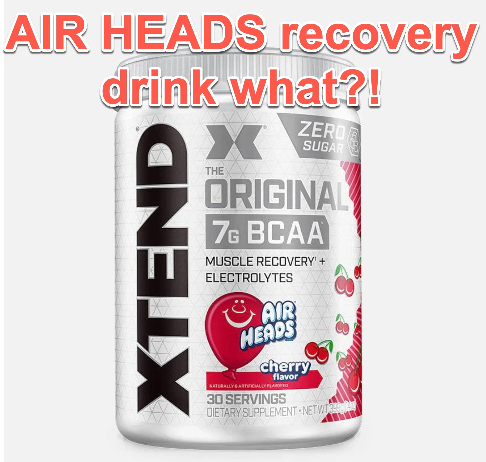

XTEND® Original BCAA Powder is a muscle recovery supplement designed to help users optimize their workout results. It contains a powerful blend of 7 grams of BCAAs per serving in the ideal 2:1:1 ratio (L-Leucine, L-Isoleucine, and L-Valine) to support muscle recovery, reduce fatigue, and improve performance. Alongside BCAAs, it includes electrolytes for hydration, citrulline malate to enhance nitric oxide production, and glutamine to further aid recovery.

Try it out: [XTEND Original BCAA Powder Airheads Cherry](https://amzn.to/47ugqrE)

Available in multiple flavors like Watermelon, Blue Raspberry, and Fruit Punch, XTEND® gives you plenty of variety, allowing you to switch things up to avoid taste fatigue. Whether you’re an endurance athlete, bodybuilder, or weekend warrior, XTEND® aims to give you the edge in your workouts.

### **Key Features & Benefits**
One of the standout features of XTEND® Original BCAA Powder is its focus on muscle recovery. BCAAs are crucial for muscle repair and growth, and XTEND® delivers them in the optimal 2:1:1 ratio, which is proven to help reduce muscle soreness after intense workouts. This means you can push harder in your next session without being held back by DOMS (delayed onset muscle soreness).

XTEND® also shines in the hydration department, thanks to the electrolytes it contains. These are essential for maintaining fluid balance and preventing cramps during extended workout sessions. Unlike many other sports drinks, XTEND® is sugar-free and low-calorie, making it an ideal choice for those who are mindful of their caloric intake but still want to stay hydrated during their workout.

The inclusion of citrulline malate is another key benefit, as it can help enhance nitric oxide production, improving blood flow to muscles and increasing endurance. Whether you’re lifting weights or doing high-intensity cardio, this could mean better pumps and longer-lasting energy during your workout.

### **Taste & Mixability**
When it comes to flavor, XTEND® Original BCAA Powder is hard to beat. The product comes in a wide range of refreshing flavors that make it easy to sip on throughout your workout or day. Some standout options include Watermelon, Mango Madness, and Blue Raspberry Ice, all of which deliver a sweet, enjoyable taste without being overly artificial. Even those who usually avoid flavored supplements may find XTEND® a pleasant surprise.

Mixability is another area where XTEND® excels. The powder dissolves easily in water with minimal shaking required. There’s no graininess or chalky residue left at the bottom of your shaker bottle, which can be a common issue with other BCAA supplements. Whether you mix it with cold water or room temperature, XTEND® provides a smooth, refreshing drink.

### **Effectiveness**
The effectiveness of XTEND® Original BCAA Powder largely speaks for itself, with thousands of positive reviews from users who’ve seen real results. When used consistently, many report significant reductions in muscle soreness, allowing them to hit the gym harder and more frequently. The BCAAs help preserve lean muscle mass, which is especially important if you’re training in a calorie deficit or doing high-intensity workouts.

Additionally, the product’s fatigue-reducing properties are noticeable, particularly during longer or more grueling workouts. You may find that you can push through that final set or sprint that extra mile without feeling as worn out. It’s particularly helpful during intra-workout when you need that mid-session boost to keep going strong.

### **Who is XTEND® Best For?**
XTEND® Original BCAA Powder is a versatile supplement suitable for almost anyone who engages in physical activity. Whether you're a professional athlete, a bodybuilder, or someone who enjoys regular gym sessions, XTEND® can be beneficial for supporting muscle recovery and hydration. It’s especially useful for those who participate in intense weightlifting, HIIT, or endurance activities like running or cycling, as it helps reduce fatigue and muscle breakdown during prolonged physical exertion.

Even if you're a beginner or someone just starting their fitness journey, XTEND® is a valuable addition to your regimen. Since it doesn’t contain stimulants or caffeine, you can use it at any time of the day, making it flexible and easy to integrate into your routine.

### **Pros & Cons**
#### **Pros:**
- 7g of high-quality BCAAs in the optimal 2:1:1 ratio for effective muscle recovery.
- Zero sugar and low calorie, making it suitable for those watching their intake.
- Excellent hydration support due to the inclusion of electrolytes.
- A wide variety of great-tasting flavors.
- Mixes easily without clumping or residue.

#### **Cons:**
- Some users may find the product slightly expensive compared to other BCAA supplements on the market.
- Certain flavors may be a bit too sweet for those who prefer a more neutral taste.
- Results can vary based on individual fitness goals and workout intensity.

### **Pricing & Value for Money**
XTEND® Original BCAA Powder is priced competitively for a high-quality BCAA supplement. The cost per serving may seem a bit steep compared to lower-end products, but considering the quality ingredients, hydration support, and effectiveness, it offers great value. It’s especially beneficial if you’re looking for a supplement that can replace sugary sports drinks while also supporting muscle recovery.

When compared to other BCAAs, XTEND® stands out not only for its flavor variety but also for its additional ingredients like citrulline malate and electrolytes, which make it more than just a basic recovery product.

### **Final Verdict**
If you’re serious about your fitness goals and want a supplement that can genuinely help with muscle recovery, hydration, and endurance, XTEND® Original BCAA Powder is an excellent choice. Its well-rounded formula, delicious flavors, and solid reputation make it a worthwhile investment for anyone looking to take their training to the next level.

Whether you’re trying to reduce soreness, stay hydrated, or simply enhance your workout performance, XTEND® delivers on its promises. With consistent use, you'll likely notice a reduction in post-workout soreness, better endurance during workouts, and an overall improvement in your training experience.

### **Conclusion**
XTEND® Original BCAA Powder has earned its place as a leading supplement for good reason. Its combination of muscle recovery, hydration, and endurance benefits make it a valuable addition to any fitness routine. With its excellent taste, versatility, and proven results, it's definitely worth considering if you're looking to get more out of your workouts.

Have you tried XTEND® Original BCAA Powder? Share your experience in the comments below, and let us know how it worked for you!

Try it out: [XTEND Original BCAA Powder Airheads Cherry](https://amzn.to/47ugqrE)

### 📅 Schedule A Meeting:
- [Consultation & Project Scoping](https://calendly.com/kadad1312/1-on-1?back=1&month=2024-01)
### Affiliate Links:
- [Tesla Discount](https://ts.la/khaled835973)
- [Sour Strips](https://amzn.to/3EDWUM7)
- [Impractical Python Projects](https://amzn.to/3JpCpWH)
- [Designing Data-Intensive Applications](https://amzn.to/3Hgh5Sj)
- [Python for Data Analysis](https://amzn.to/3D0C8pl)
- [Python for Data Science Handbook](https://amzn.to/3XnZ1ez)
- [Hands-On Machine Learning w/Scikit-Learn & Tensorflow](https://amzn.to/3QTWoyt)