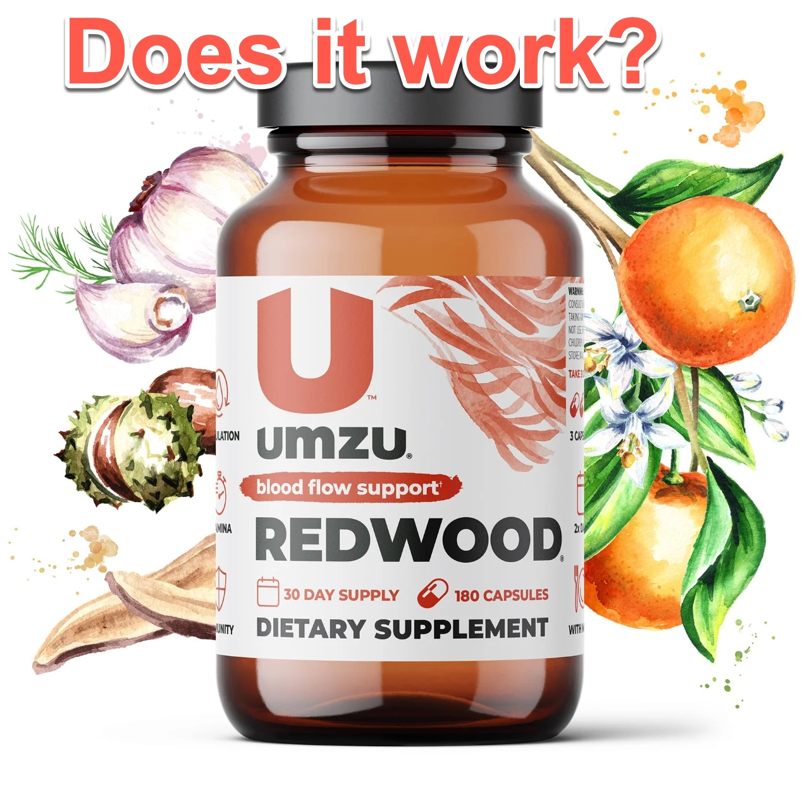

In today’s fast-paced world, maintaining optimal heart health and circulation is more important than ever. Whether you’re an athlete looking for an edge, or just someone seeking better energy levels throughout the day, nitric oxide supplements are becoming increasingly popular for their role in improving blood flow and cardiovascular function. One supplement that has caught the attention of many is UMZU’s Redwood Nitric Oxide & Circulatory Support. In this review, we’ll dive deep into the product, its benefits, and whether it’s worth adding to your daily routine.

Try it out: [UMZU Redwood Nitric Oxide Supplement](https://amzn.to/3TXmunl)

### **What is UMZU's Redwood?**
UMZU is a well-known brand that focuses on natural supplements backed by science. Their Redwood supplement is designed to improve circulation by enhancing your body’s natural production of nitric oxide—a molecule that helps dilate blood vessels, allowing for better blood flow throughout the body. This, in turn, can lead to a range of health benefits, from improved energy to better heart health.

The ingredients in Redwood are carefully chosen to boost nitric oxide levels and support overall circulatory health. Key ingredients include Vitamin C, garlic powder, pine bark extract, and horse chestnut extract, all of which are known for their potential in promoting blood vessel dilation and supporting healthy circulation. With a well-rounded formula, Redwood aims to provide comprehensive circulatory support that goes beyond just boosting nitric oxide.

### **Key Benefits of Redwood**
One of the most compelling benefits of Redwood is its ability to improve circulation. Poor circulation can lead to a range of issues, from cold hands and feet to more serious cardiovascular concerns. By increasing nitric oxide production, Redwood helps widen blood vessels, making it easier for blood to flow through the body. This can result in better oxygen delivery to your muscles and organs, which is crucial for overall health.

Another major benefit is the boost in energy and stamina. As blood flow improves, so does oxygen and nutrient delivery, which can lead to increased energy levels. Many users report feeling more energized throughout the day, especially during physical activities. This makes Redwood particularly appealing to athletes or anyone looking to enhance their endurance during workouts.

Redwood also provides heart health support. Nitric oxide is essential for maintaining healthy blood pressure levels, and the supplement’s natural ingredients work synergistically to promote a healthier cardiovascular system. Additionally, some of the ingredients in Redwood, like garlic and pine bark extract, have anti-inflammatory and antioxidant properties that further contribute to heart health.

Finally, Redwood may offer immune system support thanks to its high Vitamin C content, which is well-known for its immune-boosting properties. This makes the supplement a great option for anyone looking to enhance their overall wellness.

### **Personal Experience and Testimonials**
Many users, myself included, have experienced positive results with Redwood. After just a few weeks of consistent use, I noticed a significant improvement in my energy levels and circulation. No more cold hands and feet, and I felt more alert during the day, even after a workout.

Other testimonials highlight similar benefits. People have reported better blood pressure control, improved stamina during physical activity, and a general sense of well-being. While results can vary depending on the individual, the overwhelming feedback from Redwood users is positive, with many noticing improvements in circulation and energy within the first month of use.

### **Pros and Cons**
#### **Pros:**

- The supplement is made from natural ingredients with a solid scientific basis for improving circulation and nitric oxide production.
- Users consistently report noticeable improvements in energy, stamina, and circulation within a short period of use.
- The capsule form is easy to take, and the recommended dosage is simple to follow.

#### **Cons:**

- Price: At around $40-$45 per bottle, Redwood may seem a bit pricey for some, especially if you plan to take it long-term. However, many feel the results are well worth the investment.
- Individual results: Like with any supplement, results can vary. While many see great improvements, others may experience more modest changes, depending on their health status and lifestyle.
- Possible side effects: Although the ingredients are natural, some people may experience mild side effects such as digestive discomfort, particularly with garlic or horse chestnut extract.

### **How Redwood Compares to Other Supplements**
When compared to other nitric oxide supplements on the market, Redwood stands out for its holistic approach. While some products focus solely on nitric oxide production, Redwood combines several ingredients that support circulation and heart health in a comprehensive way. The addition of antioxidants like Vitamin C and anti-inflammatory compounds like garlic and pine bark extract make it a more well-rounded option.

Redwood also has an edge over many competitors because of UMZU’s commitment to transparency and quality. Each ingredient is carefully sourced, and the formulation is designed to be both effective and safe, which sets it apart from other supplements that may rely on synthetic or filler ingredients.

### **Who Should Consider Redwood?**
Redwood is ideal for anyone looking to improve circulation, whether due to cold extremities, low energy, or a desire to enhance physical performance. It’s particularly useful for athletes or active individuals who want to increase stamina and endurance. The supplement is also a great option for those concerned about heart health, as it supports healthy blood pressure and overall cardiovascular function.

However, if you have certain medical conditions or are on medications that affect circulation or blood pressure, it’s best to consult your doctor before adding Redwood to your regimen. Pregnant or breastfeeding women should also check with a healthcare professional before using the product.

### **Pricing and Availability**
Redwood is available directly from UMZU’s website, as well as other online retailers. A single bottle costs around $40-$45, which provides a month’s supply if you follow the recommended dosage of six capsules per day. While this may seem a bit expensive, UMZU offers discounts for bulk purchases and subscriptions, making it more affordable over the long term.

### **Final Verdict**
Overall, UMZU’s Redwood is a well-formulated, effective supplement that delivers on its promises of better circulation, enhanced energy, and heart health support. With its natural ingredients and science-backed formulation, it’s a great option for those looking to improve their cardiovascular health and enjoy more energy throughout the day.

If you’re looking for a supplement that supports both circulation and overall wellness, Redwood is definitely worth considering. The investment is justified by the potential benefits, and many users report noticeable improvements within a short time of starting the supplement.

Try it out: [UMZU Redwood Nitric Oxide Supplement](https://amzn.to/3TXmunl)

### 📅 Schedule A Meeting:
- [Consultation & Project Scoping](https://calendly.com/kadad1312/1-on-1?back=1&month=2024-01)
### Affiliate Links:
- [Tesla Discount](https://ts.la/khaled835973)
- [Sour Strips](https://amzn.to/3EDWUM7)
- [Impractical Python Projects](https://amzn.to/3JpCpWH)
- [Designing Data-Intensive Applications](https://amzn.to/3Hgh5Sj)
- [Python for Data Analysis](https://amzn.to/3D0C8pl)
- [Python for Data Science Handbook](https://amzn.to/3XnZ1ez)
- [Hands-On Machine Learning w/Scikit-Learn & Tensorflow](https://amzn.to/3QTWoyt)