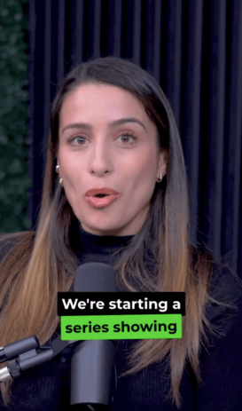
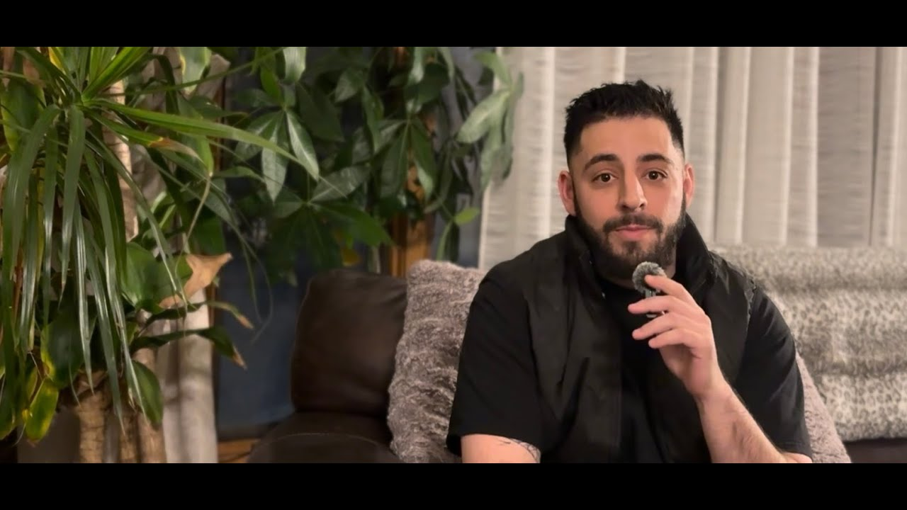

At Overwatch, we’ve always believed that real estate content should do more than just look good — it should **educate, empower, and build trust**. That belief is exactly why we’re excited to officially announce our collaboration with **Dream House Real Estate**, alongside managing broker **Sabrina Delgado**, and **Itsel Rodriguez**, loan officer with **Neighborhood Loans**.

Together, we’re launching a short-form video series designed to bring **real, useful information** directly to home buyers and sellers — without the fluff.

---

## Why This Collaboration Matters

Buying or selling a home can feel overwhelming. Between financing, negotiations, market shifts, and property presentation, there’s a lot happening behind the scenes that most people never get to see explained clearly.

This collaboration brings together:
- **Real estate expertise** (Dream House Real Estate)
- **Mortgage and lending insight** (Neighborhood Loans)
- **Modern visual storytelling & aerial media** (Overwatch)

The goal is simple: **make the process easier to understand and more transparent**.

---

## What the Video Series Covers

The short-form clips we’re releasing across YouTube and social platforms focus on:
- What buyers should know before starting the process  
- Common mistakes sellers make (and how to avoid them)  
- How lending decisions impact real-world buying power  
- Why presentation, media, and marketing matter more than ever  

Each clip is designed to be **quick, practical, and actionable** — something you can actually use, not just scroll past.

---

## Building Value Through Collaboration

This series isn’t about selling services — it’s about **building value through collaboration**. When professionals from different parts of the real estate ecosystem work together, clients benefit from clearer communication, better preparation, and stronger outcomes.

For us at Overwatch, this project represents what we’re working toward long-term: partnering with industry professionals to create content that **informs first and impresses second**.

---

## Watch the Full Project Video

If you’d like a deeper look at how this collaboration came together and what we’re building moving forward, you can watch the full project video here:

More clips, insights, and conversations are coming soon — and we’re just getting started.
